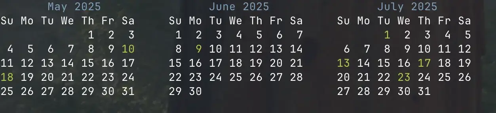
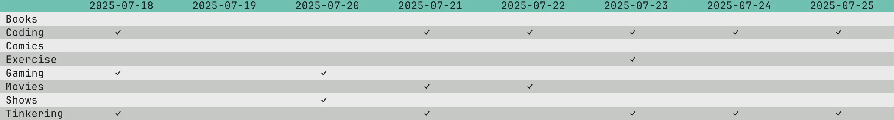

# habit-tracker

CLI app to track habits. I found existing solutions but it's web-based. Being used to command-line interface, the web interface doesn't quite click with me. It's not them, it's me.

Also I have pretty weird attention span. I tend to do the same thing for a week straight, then never pick it up again until a few months or half a year later. I want to see my own pattern, hence why there are no stats features.

## Usage

```bash
Display habits activity in tui

Usage:
  habit-tracker [command]

Available Commands:
  completion  Generate the autocompletion script for the specified shell
  create      Create a habit.
  do          Track a habit
  help        Help about any command
  show        Show habit stats for the last 3 months
  show-6m     Show habit stats for the last 6 months
  show-year   Show habit stats for current year
  today       Show habit stats for today
  undo        Untrack a habit
  week        Show habit stats for week

Flags:
  -h, --help     help for habit-tracker
  -t, --toggle   Help message for toggle

Use "habit-tracker [command] --help" for more information about a command.
```

```bash
# create habit
habit-tracker create Foo

# track habit
habit-tracker do Foo  # today
habit-tracker do Foo 2025-01-01 # specify date

# untrack habit for today
habit-tracker undo Foo

# show habit activities
habit-tracker show Foo  # also checkout `show-6m`, `show-year

# show today's habits
habit-tracker today

# show past week's habits
habit-tracker week
```

`habit-tracker show $HABIT`



`habit-tracker week`


